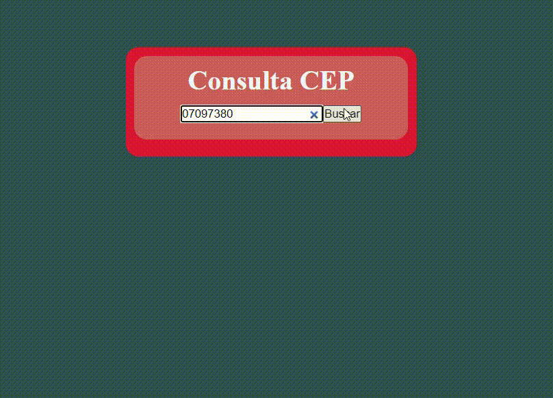

# Curso Jquery e Ajax da Dio

O curso de Jquery e Ajax é uma iniciativa da [Digital Innovation One.](https://web.dio.me/home) para ensinar os pilares da linguagem e seus conceitos mais básicos.

## Conteúdo

- Consumo da API de endereço.
- Utilizado Ajax e Jquery
## Modelo

